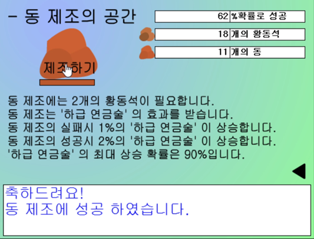
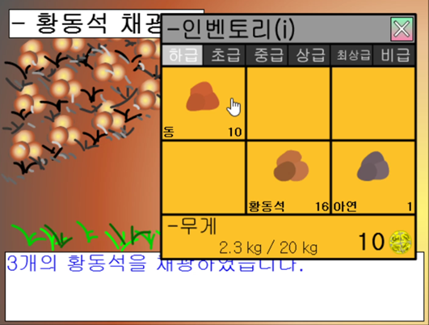

# 연금술

|      |      |
| ---- | ---- |

프로젝트 소개 : 연금술은 재료를 모아 여러가지 광석을 만들고 물건을 만드는 게임입니다.

사용 기술 : Flash Action Script 2.0, Macromedia Flash MX 2004

담당 역할 : 게임 개발 전체

개발 기간 : 2009년 12월 ~ 2010년 1월

핵심 기술 / 알고리즘 : 퀘스트 시스템, 무작위 요소 도입(랜덤 함수 이해)

최초 업로드 홈페이지 : https://cafe.naver.com/shiftouch/364996

플레이 영상 : https://youtu.be/7qk18COOrok

프로젝트 주소 : https://github.com/justkoi/The-alchemy

